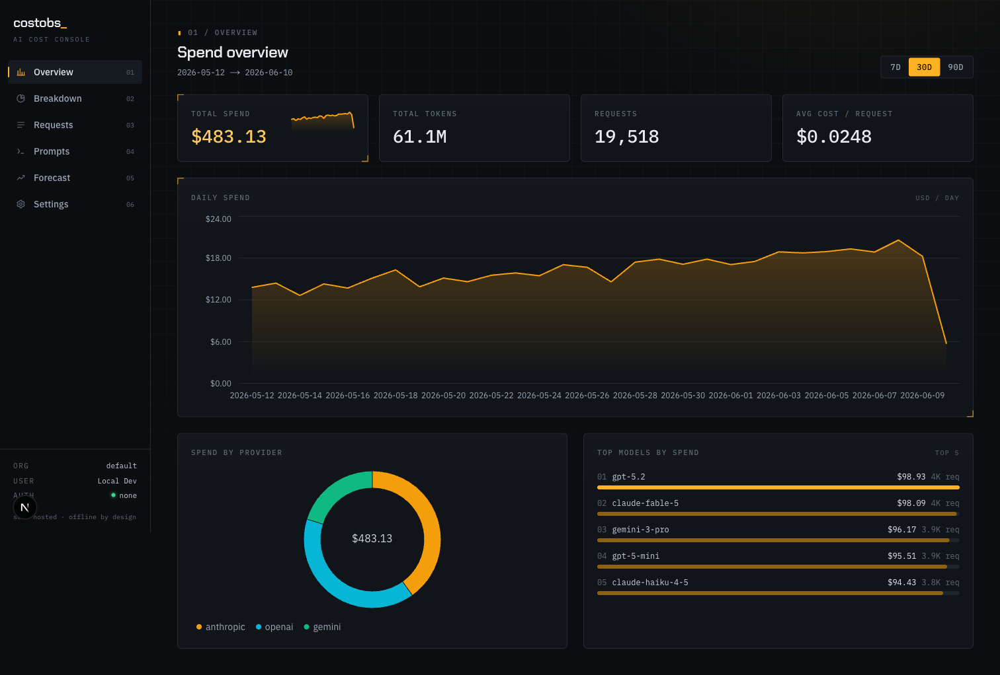

# CostObs

[](https://github.com/officialasishkumar/costobs/actions/workflows/ci.yml)
[](LICENSE)
[](https://costobs.vercel.app)
[](https://costobs.vercel.app/docs.html)

**Open-source, fully self-hostable AI/LLM cost observability — with per-request
attribution.** Website: **[costobs.vercel.app](https://costobs.vercel.app)**

CostObs tells you exactly what every LLM/provider call costs and
attributes it to the dimensions you care about (customer, feature, team,
environment, prompt version), so you can answer "what is this costing us, and
where is it going?" — without shipping a byte of your data to anyone else.

## The killer differentiator

CostObs is **fully self-hostable and offline by design**. No phone-home
telemetry, no licensing checks, no mandatory cloud control plane, no required
external service calls. The SDK computes cost locally from a bundled pricing
file and ships telemetry **asynchronously, off your request hot path** —
observing cost never adds latency or a failure mode to your product traffic.
Run the whole thing on a laptop with `docker compose up`, or on Kubernetes in
your own (even air-gapped) cluster.



## Features

- **Per-request cost attribution** by customer, feature, team, service,
  environment, user, trace, prompt version — and **any custom tag**
  (cost per PR, per engineer, per experiment: see
  [docs/engineering-roi.md](docs/engineering-roi.md)).
- **Multi-provider:** OpenAI, Anthropic, Gemini, AWS Bedrock, LiteLLM, the
  Vercel AI SDK, and every OpenAI-compatible API (xAI/Grok, Together,
  Fireworks, OpenRouter, Groq, DeepSeek, Mistral, Azure) auto-detected from
  the client's base URL. Anything else via the manual `record()` API
  (Deepgram audio-seconds, ElevenLabs characters, raw HTTP).
- **Three ways to attach metadata:** wrap-time defaults, `request_context()`
  context manager, `@trace()` decorator — plus per-call overrides.
- **Accurate local cost calc** from a versioned pricing file (per-token, cached
  tokens, reasoning, tool, image tiers, audio-seconds, characters, batch
  discount, fine-tune surcharge), using exact decimal math.
  See [docs/pricing.md](docs/pricing.md).
- **No prompt/response content stored** — the wire schema has no slot for it.
- **Time-series analytics** on ClickHouse with materialized rollups (daily cost,
  hourly attribution, prompt-version A/B with p95 latency).
- **Invoice reconciliation** (`billsyncd`, opt-in): syncs actual billed cost
  from OpenAI/Anthropic admin APIs and shows drift + untracked spend.
  See [docs/billing-sync.md](docs/billing-sync.md).
- **Forecasting:** Holt-Winters weekly-seasonal, linear, and exponential
  projections with R², month-end estimates — free, not a paid tier.
- **Alerting** (`alertd`): daily thresholds, spikes, monthly budgets → webhook /
  Slack.
- **Dashboard** (Next.js) — dark console UI with overview (MoM deltas),
  pairwise + tag breakdowns, request drill-down, prompt A/B, forecast, and
  reconciliation. Optional OIDC auth seam; defaults to single-user mode.
- **Self-hosting first-class:** Mode A (Compose) and Mode B (Helm), both fully
  offline; BYO external Postgres + ClickHouse or use bundled single-node
  instances.
- **Observability of the observer:** every service exposes `/healthz` and
  Prometheus `/metrics`.

## Monorepo layout

```
sdks/python/         CostObs SDK: wrap() proxy, record(), local pricing, async telemetry shipper
sdks/typescript/     Same for Node/TS, incl. Vercel AI SDK helpers
services/ingest/     Go ingestion API (:8080): POST /v1/events, auth, dedup, batch→ClickHouse
services/alertd/     Go periodic alert evaluator (singleton, :8081)
services/billsyncd/  Go billing sync: provider admin APIs → billed_daily (opt-in, :8082)
apps/dashboard/      Next.js UI + read API (:3000)
db/postgres/         Postgres migrations (metadata: orgs, api_keys, alert rules, overrides)
db/clickhouse/       ClickHouse migrations (events fact table + materialized rollups)
shared/proto/        event.schema.json — the SDK↔ingest wire contract
shared/pricing/      versioned pricing YAML + schema.json
deploy/helm/costobs/ Mode B Kubernetes Helm chart
deploy/k8s-examples/ values-small.yaml / values-prod.yaml
docs/                architecture, self-hosting, pricing
docker-compose.yml   Mode A: the whole stack, one command
```

## Quickstart — Mode A (Docker Compose)

```bash
cp .env.example .env
docker compose up
```

This brings up ClickHouse + Postgres, runs migrations, then `ingest` (:8080),
`alertd`, and the `dashboard` (:3000). A default org and a dev API key are
seeded on boot. Open <http://localhost:3000>.

Send your first event with the dev key:

```python
import costobs
from openai import OpenAI

costobs.configure(
    ingest_url="http://localhost:8080",
    api_key="costobs_dev_secret_key",   # seeded dev key (see .env)
)

client = costobs.wrap(OpenAI(), team="payments", environment="prod", service="api")

with costobs.request_context(customer_id="cust-42", trace_id="trace-abc"):
    client.chat.completions.create(
        model="gpt-4o",
        messages=[{"role": "user", "content": "Summarize CostObs in one line."}],
        feature="summarize",
        prompt_version="v1",
    )

costobs.flush()   # drain telemetry before a short-lived script exits
```

Or run the bundled offline demo (works with no provider key):

```bash
COSTOBS_INGEST_URL=http://localhost:8080 \
COSTOBS_API_KEY=costobs_dev_secret_key \
python sdks/python/examples/quickstart.py
```

## Mode B — Kubernetes (Helm)

Production self-hosting with scaling, TLS/ingress, OIDC, and bring-your-own
external databases lives in the chart at `deploy/helm/costobs`. See
**[docs/self-hosting.md](docs/self-hosting.md)** for the full guide
(small vs. prod values, BYO databases, air-gapped notes). In short:

```bash
helm install costobs deploy/helm/costobs \
  -f deploy/k8s-examples/values-small.yaml \
  --namespace costobs --create-namespace
```

## Architecture

```
  YOUR APP ──(1: real call, sync)──► LLM PROVIDER
     │  costobs.wrap(client)
     │  (2: local cost calc, 3: build event — NO prompt content)
     ▼
  background ship queue ──(4: async batched POST /v1/events)──► ingest (Go, :8080)
                                                                  │ auth (Postgres) + dedup
                                          ┌───────────────────────┴───────────────────────┐
                                          ▼                                                 ▼
                              ClickHouse (events + rollups)                    Postgres (orgs, api_keys,
                                          │ HTTP :8123                          alert_rules, overrides)
                                          ▼                                                 │
                              dashboard (Next.js, :3000) ◄────────────────────────────────┘
                              alertd (Go, :8081) reads rules (PG) + aggregates (CH) → webhook/slack
```

Full details: **[docs/architecture.md](docs/architecture.md)**.

## Documentation

- [docs/architecture.md](docs/architecture.md) — components, data flow, storage layers, wire contract, principles.
- [docs/self-hosting.md](docs/self-hosting.md) — Mode A and Mode B, BYO databases, TLS/OIDC, scaling, air-gapped.
- [docs/pricing.md](docs/pricing.md) — the versioned pricing file, field semantics, overrides, updating without an SDK release.
- [docs/billing-sync.md](docs/billing-sync.md) — billsyncd setup, reconciliation semantics, manual invoice import.
- [docs/engineering-roi.md](docs/engineering-roi.md) — cost per PR / engineer / experiment via tag attribution.

## Non-goals

- **Not a proxy/gateway.** CostObs never sits inline with provider traffic; your
  calls go straight to the provider.
- **Not prompt/response logging.** CostObs measures cost and request shape, not
  content. There is deliberately no place to store prompt or completion bodies.
- **Not a SaaS.** There is no hosted control plane, no account, no phone-home.
- **Not a billing system of record.** It is observability and attribution, not
  an invoicing engine.

## License

Apache-2.0. See [LICENSE](LICENSE).
